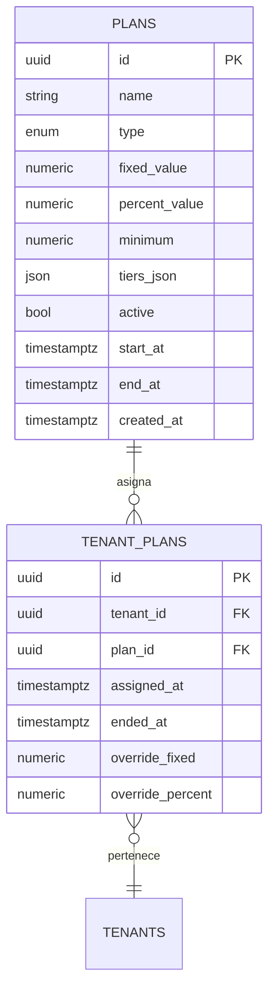

# 13. Modelado y Cálculo de Planes Tarifarios

Este capítulo describe cómo GetUpNet implementa la monetización multi-tenant a través de planes tarifarios flexibles, alineados con los lineamientos de la sección 4 del prompt maestro. Se incluyen los modelos de datos, fórmulas de cálculo, estrategias de auditoría y recomendaciones para pruebas automatizadas.

## 13.1 Objetivos de diseño

- **Flexibilidad**: soportar planes `FIJO`, `PORCENTAJE`, `MIXTO` y `ESCALONADO` con mínimos opcionales y overrides por tenant.
- **Trazabilidad**: persistir en cada factura los campos `plan_id`, `tarifa_plan` y `monto_tarifa` para reportes regulatorios y conciliación.
- **Reutilización**: exponer un servicio `plans_service` reutilizable desde los portales Admin y Cliente.
- **Observabilidad**: emitir métricas Prometheus (`plans_calculation_total`, `plans_overridden_total`) con etiquetas por tipo de plan y tenant.

## 13.2 Modelo de datos



### Campos calculados en `invoices`

| Campo | Descripción |
| --- | --- |
| `plan_id` | Plan aplicado al comprobante. |
| `tarifa_plan` | Tipo de tarifa (`FIJO`, `PORCENTAJE`, etc.). |
| `monto_tarifa` | Importe calculado tras aplicar overrides y mínimos. |

## 13.3 API de cálculo

El servicio expone la función `calculate_charge(amount: Decimal, plan: Plan, overrides: TenantPlanOverrides) -> PlanComputationResult` que encapsula el siguiente flujo:

1. Determinar el plan vigente (vigencia por `start_at`/`end_at` y estado `active`).
2. Ejecutar el algoritmo de cálculo según el tipo del plan.
3. Aplicar mínimos y overrides (`override_fixed`, `override_percent`).
4. Registrar auditoría (`audit_logs`) con hash encadenado.
5. Retornar estructura con `tarifa_aplicada`, `monto_calculado`, `detalle_tramos` y `metadata` para dashboards.

### Pseudocódigo

```python
if plan.type == PlanType.FIJO:
    base = plan.fixed_value
elif plan.type == PlanType.PORCENTAJE:
    base = amount * plan.percent_value / 100
elif plan.type == PlanType.MIXTO:
    base = plan.fixed_value + amount * plan.percent_value / 100
elif plan.type == PlanType.ESCALONADO:
    base = compute_tiered_amount(amount, plan.tiers)

base = apply_overrides(base, amount, overrides)
charge = max(base, plan.minimum or Decimal("0"))
```

## 13.4 Tramos escalonados (`ESCALONADO`)

- `tiers_json` sigue el formato `[{"from": 0, "to": 250000, "percent": 0.85}, {"from": 250000, "percent": 0.65}]`.
- Los tramos son validados con reglas de negocio para evitar solapamientos y huecos.
- El cálculo se realiza aplicando el porcentaje correspondiente al monto ubicado en cada tramo.

## 13.5 Integración con los portales

- **Admin Portal**: pestaña "Planes" en `/companies/:id` permite asignar plan y overrides. Usa hooks `usePlans()` y `useAssignPlan()` (React Query) y componentes `PlanSummaryCard` (shadcn/ui `Card`).
- **Client Portal**: sección "Dashboard" muestra KPIs de consumo y cargos, reutilizando `PlanBadge` para resaltar el plan vigente.
- Ambos portales consultan `GET /tenant/settings` para obtener el plan activo y el historial simplificado.

## 13.6 Auditoría y métricas

- Cada cálculo genera un registro en `audit_logs` con `action="PLAN_CHARGE_COMPUTED"`.
- Exponer métricas:
  - `plans_calculation_total{tenant="<uuid>", plan="FIJO"}`
  - `plans_minimum_applied_total{tenant="<uuid>"}`
- Logs estructurados incluyen `plan_id`, `tenant_id`, `charge_amount` y `trace_id`.

## 13.7 Testing

- **Unitarios**: cobertura completa de las ramas de cálculo (incluyendo overrides y mínimos).
- **Contract Testing**: fixtures JSON para validar payloads enviados a los portales.
- **E2E**: escenarios que emiten comprobantes con diferentes montos y verifican que el cargo se refleje en la UI y en los reportes del Admin Portal.
- **Regresión**: snapshot tests para los reportes de planes.

## 13.8 Roadmap

- Motor de reglas personalizadas por tenant.
- Integración con pasarelas de pago para debitar automáticamente los cargos calculados.
- Visualizaciones dinámicas en Grafana (panel `GetUpNet/Plans`) con alertas por consumo atípico.
